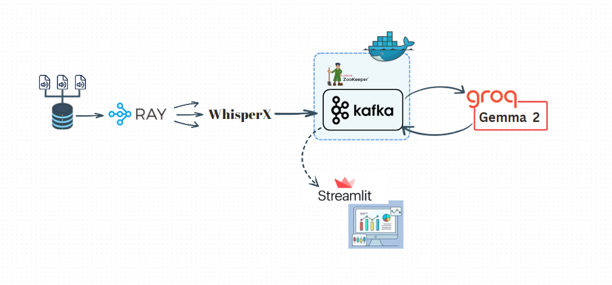

# Call-Center-Project

<h1>Adımlar</h1>

<h4> 1.Adım </h4>

 Groq API Key alarak .env dosyasına eklenmeli 

<h4> 2.Adım </h4>

 requirements.txt dosyasındaki gereklilikleri indir. 

<h4> 3.Adım </h4>

 ffmpeg modülünü system-wide olarak install et. 

<h4> 4.Adım </h4>

 docker compose up --build -d ile kafkayı ayağa kaldır 

<h4> 5.Adım </h4>

 python Main.py ile projeyi başlat 

<h2> Pipeline Architecture </h2>

  

<h2> NOT </h2>

 Audio2Text.py dosyasında zaten belirttim. Whisperx modelini cpu da çalıştırmak biraz uzun dürüyor. Sisteme göre değişiklik yapılabilir 

