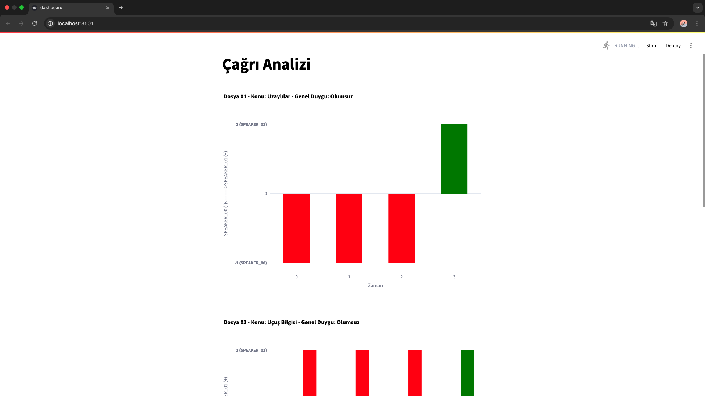

# Call-Center-Project

## How to run the demo?

### Step 1: Install modules and libraries in requirements.txt
```shell
pip install -r requirements.py
```

### Step 2: Install ffmpeg system-wide
  For Linux:
   ```shell
   sudo apt update
   sudo apt install ffmpeg
  ```
   
  For macOS:
  ```shell
  brew install ffmpeg
  ```

### Step 3: Create GroqAPI Key 
Obtain the Groq API Key and add it to the `.env` file.

### Step 4: Create HuggingFace Access Token
Obtain the Access Token and add it to user_token variable in the `Audio2Text.py` file.

### Step 5: Clone the Repository
```shell
git clone https://github.com/RanaBetulKaya/Call-Center-Project
```

### Step 6: Add your audio files to data folder 
There is already files in the data folder. But if you want to add your own, you should add to this data directory.

### Step 7: Run docker compose file 
```shell
docker compose up --build -d
```

### Step 8: Run app with Python
```shell
python main.py
```

### Step 9: Run streamlit app
In another terminal window:
```shell
streamlit run dashboard.py
```
<p align="center">
  
</p>

## Pipeline Architecture
<p align="center">
  
</p>

## NOTE
It may take some time to run the WhisperX model on the CPU in the 'Audio2Text.py' file. Depending on your system, you can use mps or cuda.
